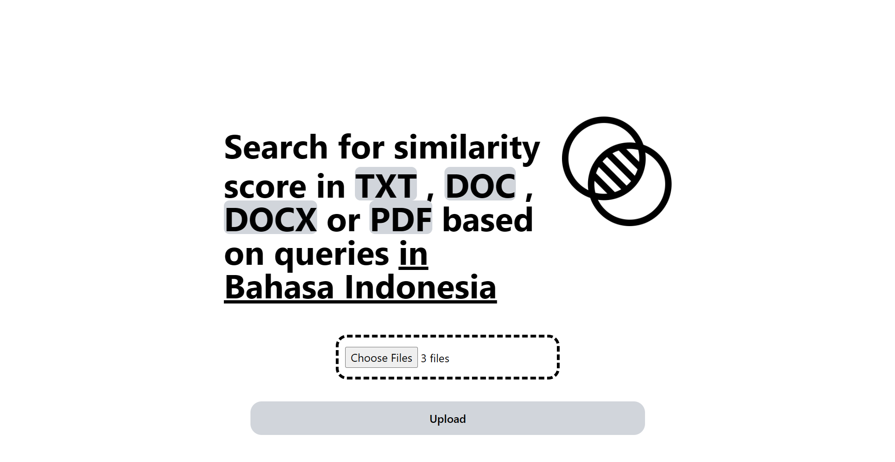
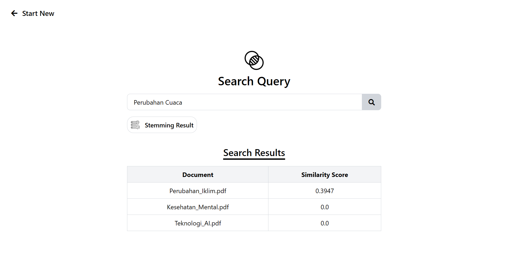
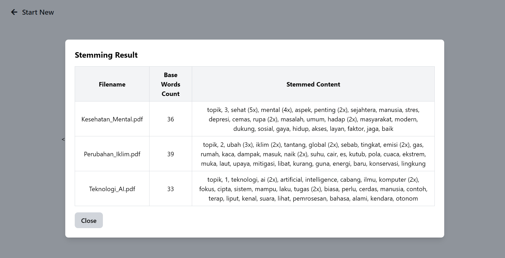

# TemuDoc

**TemuDoc** is a document retrieval system built with **Flask** that allows you to upload documents and search for their similarity scores based on queries in **Bahasa Indonesia**.

---

## Features

- Upload multiple documents (`.txt`, `.doc`, `.docx`, `.pdf`).
- View stemming results (base words count and processed content).
- Compute similarity scores between query and documents.
- Display search results based on queries.

---

## Project Structure

```
TemuDoc/
│
├── app.py              # Flask backend
│
├── results/            # Screenshot of Results
│   ├── home.png
│   ├── search.png
│   ├── search_result.png
│   ├── stemming_result.png
│
├── templates/
│   ├── index.html      # Upload page
│   ├── results.html    # Search results page
│
├── static/
│   ├── similarity.png  # App logo
│   ├── stemming.png    # Popup icon
│
├── uploads/            # Folder for uploaded documents
├── stopwords.csv       # Stopwords list for filtering
├── requirements.txt    # Dependencies
└── README.md
```

---

## Installation

1. **Clone the repository**

   ```bash
   git clone https://github.com/reyhanarief/TemuDoc.git
   cd TemuDoc
   ```

2. **Create a virtual environment (recommended)**

   ```bash
   python -m venv venv
   source venv/bin/activate  # macOS/Linux
   venv\Scripts\activate     # Windows
   ```

3. **Install dependencies**

   ```bash
   pip install -r requirements.txt
   ```

4. **Run the app**

   ```bash
   python app.py
   ```

5. Open your browser and go to:
   ```
   http://127.0.0.1:5000
   ```

---

## Dependencies

Main libraries used:

- Flask
- Pandas
- Scikit-learn
- Sastrawi
- pdfplumber
- python-docx

(Include them in `requirements.txt`)

---

## How It Works

1. **Upload Documents**

   - User uploads one or more documents (`TXT`, `DOC`, `DOCX`, `PDF`).
   - Files are saved into the `uploads/` folder.

2. **Preprocessing Pipeline**  
   Each document goes through the following steps:

   - **Case Folding** → convert all text to lowercase.
   - **Tokenization** → split text into words.
   - **Filtering** → remove stopwords (from `stopwords.csv`).
   - **Stemming** → reduce words to their root form using **Sastrawi**.

3. **Vectorization**

   - Preprocessed documents are converted into vectors using **TF-IDF** (`scikit-learn`).

4. **Search Query**

   - When a user enters a query, the same preprocessing pipeline is applied to the query.
   - The query is transformed into a TF-IDF vector.

5. **Similarity Calculation**

   - Compute **cosine similarity** between the query vector and document vectors.
   - Rank documents based on similarity scores.

6. **Results Display**
   - A table shows documents with their similarity scores (rounded to 4 decimals).
   - A popup modal allows viewing **stemming results** (base words count & processed content).

---

## Screenshots

- **Home Page**
  
- **Search Results with Similarity Scores**
  
  
- **Stemming Result**
  

---

## License

[](LICENSE)
